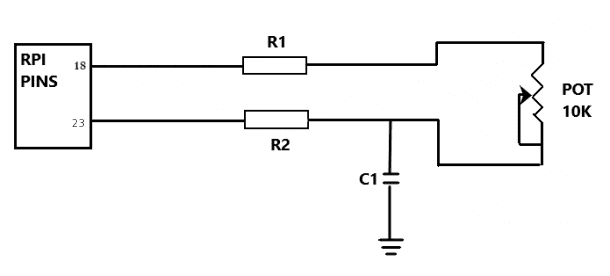
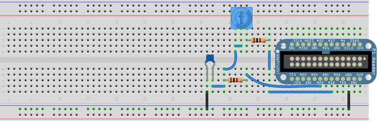
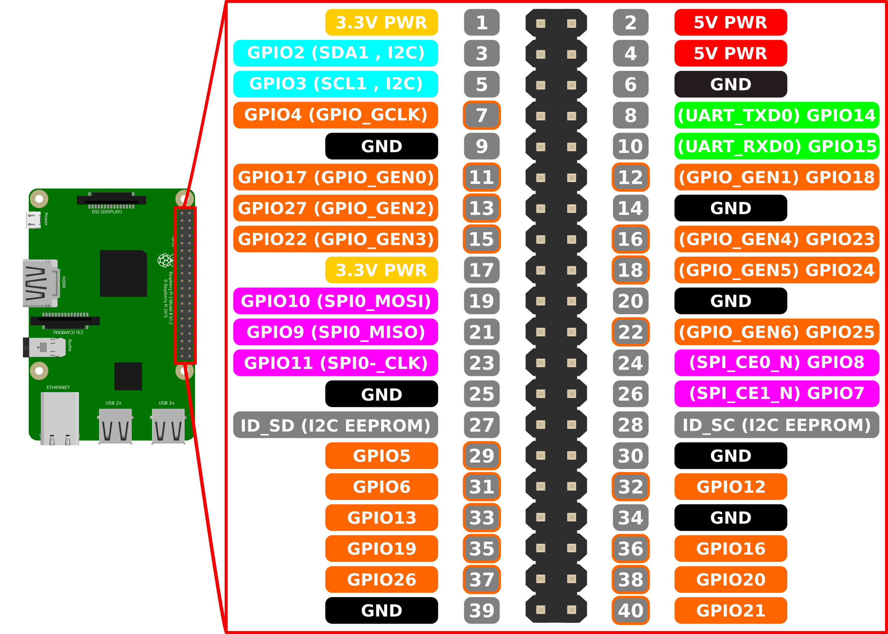

# Raspberry Pi TCode Controler for OSR2

This is a simple implementation to control the OSR2 Up/Down Stroke speed with an Potentiometer.

## Reading the Potentiometer value

The Raspberry Pi isn't able to read electrical analog signals or data. Therefore we use a simple charging-discharging circuit to measure the Potentiometer.

### Project Parts List

- Raspberry Pi (Model A+,B, B+, or the Pi 2, ...)
- 2 x 1 Kilo-ohm resistor (brown, black, brown, gold), 1/4W, 5%
- 10 Kilo-ohm or 50 Kilo-ohm Potentiometer
- 220nF or 100nf capacitor
- Jumper wires

### Wiring Diagram



NOTE: 18 and 23 are the GPIO Pins not the Pin numbers, see GPIO Pin assignment below.





### Description

We basically use R1 and the Potentiometer to charge the circuit together, and R2 to discharge the circuit which is then read by a python code to give us the values for the step-response change with time.

## Run `osr2_controler.py` at start

```bash
sudo crontab -e
```

add:

```
@reboot python3 /home/pi/Documents/osr2_controler.py
```

make sure the cron service is active:

```bash
sudo systemctl status cron.service
```
